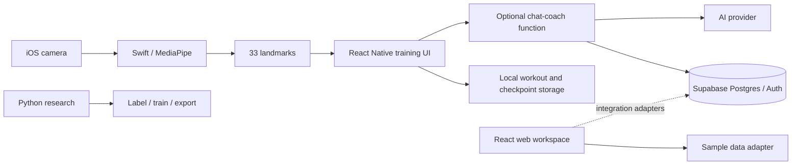

# How the pieces fit

The solid paths describe implemented code paths; the web adapters require integration work described in [Status](STATUS.md). The native camera produces coordinates on the device. Mobile React state and the geometric analysis functions consume them. AsyncStorage keeps local training history.

Supabase holds the account and conversation foundation, with SQL for sessions, plans and checkpoints. The optional coaching function verifies the caller and conversation owner before reading messages or invoking its provider. Keep provider keys in server secrets.

The ML workspace is independent of the running apps. Its notebooks describe a custom phase/correction model using normalized landmarks and an exercise identifier. Training and exporting that model does not automatically connect it to the mobile runtime.
